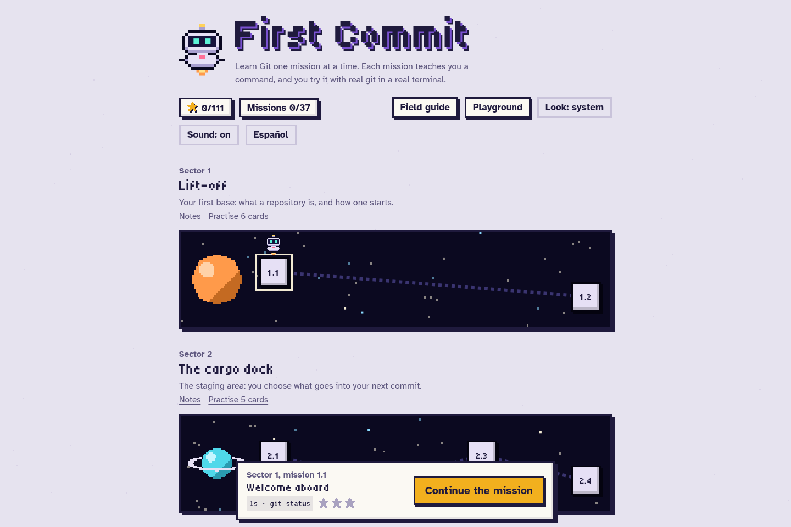
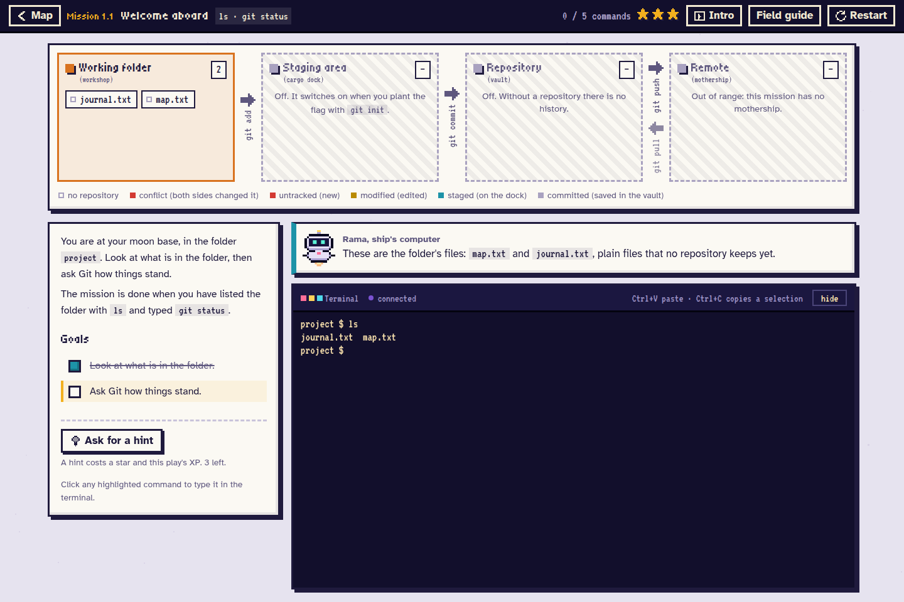
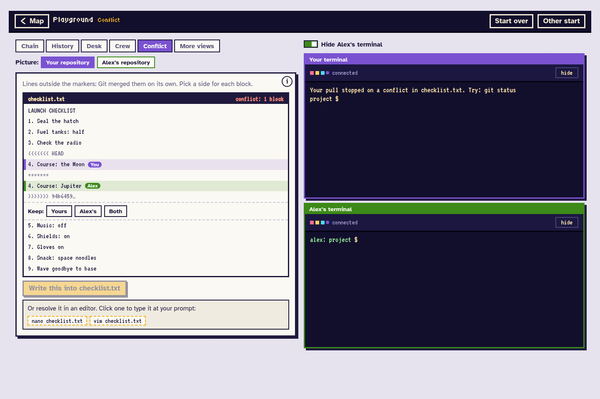
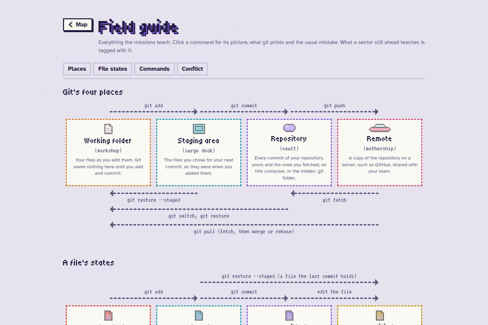

# First Commit

Learn Git through small missions, a real terminal, and a playground where you can experiment.
This game was created with help from AI for educational purposes.



## Install and play

On **Ubuntu 24.04**, including **WSL**, download or clone this repository and open a terminal
inside its `firstcommit` folder. Then run:

```bash
./install.sh
./run.sh
```

The installer sets up Git, uv, and the game's dependencies. It may ask for your sudo password.
When the game starts, open the browser link it prints. Keep the terminal open while you play;
press Ctrl-C to stop. Your progress is saved locally.

## Screenshots

**Guided missions.** Read the goals, try real Git commands, and see what changes in your repository.



**The playground.** Practise with a teammate's repository and work through a merge conflict.



**The field guide.** Keep a visual explanation of Git's commands and file states close at hand.


