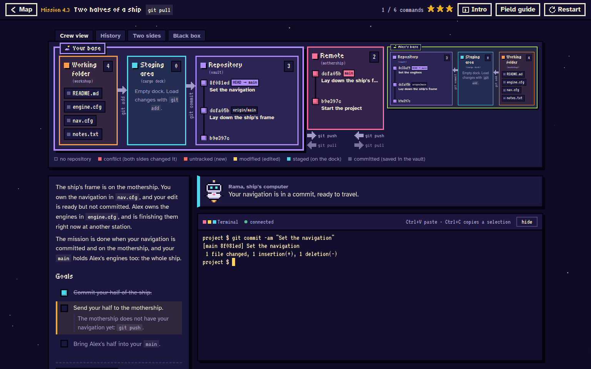
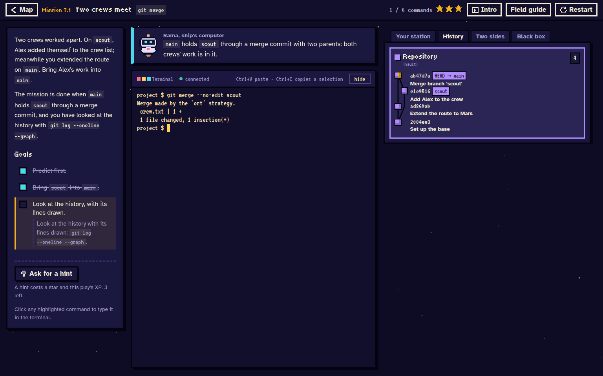
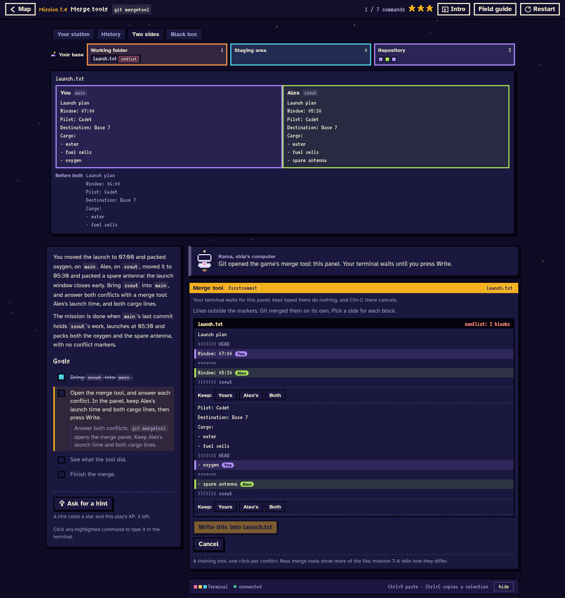

# First Commit

Learn Git through small missions, a real terminal, and a playground where you can experiment.



## Install and play

On **Ubuntu 24.04**, including **WSL**, download or clone this repository and open a terminal
inside its `firstcommit` folder. Then run:

```bash
./install.sh
./run.sh
```

The installer sets up Git, uv, and the game's dependencies. It may ask for your sudo password.
When the game starts, open the browser link it prints. Keep the terminal open while you play;
press Ctrl-C to stop. Your progress is saved locally.

## Screenshots

**Merge history.** Follow two branches into a commit with two parents, while Rama explains what changed.



**Conflict resolution.** Compare both versions and choose an answer for each conflict in the built-in merge tool.



Created with help from AI for educational purposes. Licensed under [Apache 2.0](LICENSE). Third-party notices are in [NOTICE](NOTICE).
